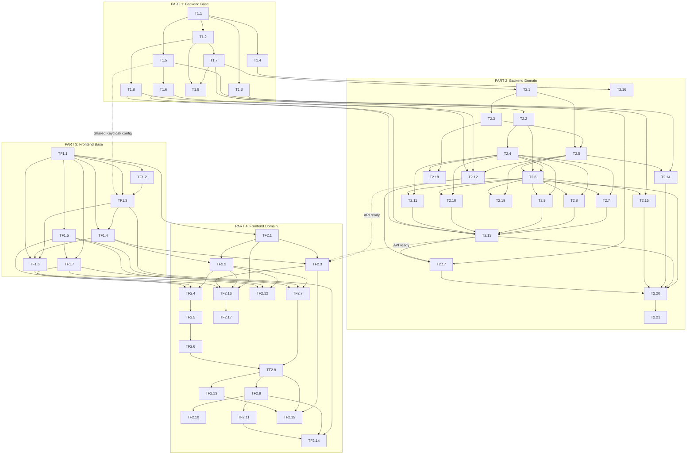

# Tickets - Recruitment Approval Request Service (DAR)

> Each ticket is a self-contained LLM prompt designed to be processed sequentially.
> Tickets reference specification files in `../specifications/fr/` for full context.
> **Backend tickets** (T prefix) target the Kotlin/Spring Boot API.
> **Frontend tickets** (TF prefix) target the Nuxt 3 µFrontend UI.

---

## PART 1: Backend - Base Technical Steps (Template Adaptation)

These tickets transform the `poc-beetween` Kotlin/Spring Boot template into a project skeleton ready for the DAR business logic. No domain-specific logic is introduced here.

| Ticket | Title | Depends on | Blocks |
|--------|-------|------------|--------|
| [T1.1](./T1.1.md) | Rename Project Identity & Packages | Nothing | All subsequent backend tickets |
| [T1.2](./T1.2.md) | Remove Greeting Sample Domain | T1.1 | T1.7 |
| [T1.3](./T1.3.md) | Add MongoDB Dependency & Configuration | T1.1 | T2.14, T2.15 |
| [T1.4](./T1.4.md) | Add Apache Pulsar Dependency & Configuration | T1.1 | T2.16 |
| [T1.5](./T1.5.md) | Update Keycloak Configuration for DAR Realm | T1.1 | T1.6, T2.17 |
| [T1.6](./T1.6.md) | Set Up JWT Token Generation Endpoint for Dev/Test | T1.5 | T2.12, T2.13 |
| [T1.7](./T1.7.md) | Set Up Project Package Structure | T1.2 | T2.1, T2.2 |
| [T1.8](./T1.8.md) | Set Up Base Response Wrapper & Pagination DTOs | T1.2 | T2.12, T2.13 |
| [T1.9](./T1.9.md) | Update ArchUnit Tests for New Architecture | T1.2, T1.7 | None (quality gate) |

---

## PART 2: Backend - Project-Specific Tickets

These tickets implement the actual DAR backend business logic. They should be processed in the order indicated by dependencies.

| Ticket | Title | Depends on | Blocks |
|--------|-------|------------|--------|
| [T2.1](./T2.1.md) | Implement Workflow Domain Model | T1.7 | T2.3, T2.5 |
| [T2.2](./T2.2.md) | Implement Request Domain Model | T1.7, T2.1 | T2.4, T2.6 |
| [T2.3](./T2.3.md) | Implement Workflow Domain Business Rules | T2.1 | T2.5 |
| [T2.4](./T2.4.md) | Implement Request Domain State Machine (TransitionEngine) | T2.2 | T2.7, T2.8, T2.9, T2.10, T2.11 |
| [T2.5](./T2.5.md) | Implement Workflow CRUD Use Cases | T2.1, T2.3 | T2.6, T2.12, T2.14 |
| [T2.6](./T2.6.md) | Implement Request Creation & Editing Use Cases | T2.2, T2.4, T2.5 | T2.7, T2.13, T2.15 |
| [T2.7](./T2.7.md) | Implement Request Submission Use Case | T2.4, T2.6 | T2.13 |
| [T2.8](./T2.8.md) | Implement Request Approval Use Case | T2.4, T2.6 | T2.13 |
| [T2.9](./T2.9.md) | Implement Request Rejection Use Case | T2.4, T2.6 | T2.13 |
| [T2.10](./T2.10.md) | Implement Request Comment Use Case | T2.4, T2.6 | T2.13 |
| [T2.11](./T2.11.md) | Implement Request Archive Use Case | T2.4, T2.6 | T2.13 |
| [T2.12](./T2.12.md) | Implement Workflow REST Controller | T2.5, T1.6, T1.8 | T2.17, T2.20 |
| [T2.13](./T2.13.md) | Implement Request REST Controller | T2.6-T2.11, T1.6, T1.8 | T2.17, T2.20 |
| [T2.14](./T2.14.md) | Implement MongoDB Workflow Repository | T1.3, T2.5 | T2.20 |
| [T2.15](./T2.15.md) | Implement MongoDB Request Repository | T1.3, T2.6 | T2.20 |
| [T2.16](./T2.16.md) | Implement Pulsar Event Publisher | T1.4, T2.7-T2.11 | T2.20 |
| [T2.17](./T2.17.md) | Implement RBAC & Access Control | T1.5, T2.12, T2.13 | T2.20 |
| [T2.18](./T2.18.md) | Implement Domain Unit Tests | T2.3, T2.4 | None (quality gate) |
| [T2.19](./T2.19.md) | Implement Use Case Unit Tests | T2.5-T2.11 | None (quality gate) |
| [T2.20](./T2.20.md) | Implement Integration Tests | T2.12-T2.15, T2.17 | T2.21 |
| [T2.21](./T2.21.md) | Implement End-to-End Test Scenarios | T2.20 | None (final backend quality gate) |

---

## PART 3: Frontend - Base Technical Steps (Template Adaptation)

These tickets set up the Nuxt 3 µFrontend project skeleton with authentication, service layer, base UI components, and routing. No business views are implemented here.

| Ticket | Title | Depends on | Blocks |
|--------|-------|------------|--------|
| [TF1.1](./TF1.1.md) | Initialize Nuxt 3 Project with TypeScript & Tailwind CSS | Nothing | All subsequent frontend tickets |
| [TF1.2](./TF1.2.md) | Configure µFrontend Architecture & Host Communication | TF1.1 | TF1.3, TF2.14 |
| [TF1.3](./TF1.3.md) | Configure Keycloak Authentication & RBAC | TF1.1, TF1.2 | TF1.4, TF1.6, TF2.14 |
| [TF1.4](./TF1.4.md) | Set Up Service Factory Pattern & API Client | TF1.1, TF1.3 | TF2.2, TF2.3 |
| [TF1.5](./TF1.5.md) | Set Up Base UI Components Library | TF1.1 | TF2.4-TF2.13 (all views) |
| [TF1.6](./TF1.6.md) | Set Up Composables & State Management | TF1.1, TF1.3, TF1.4 | TF2.2, TF2.3, TF2.7-TF2.9 |
| [TF1.7](./TF1.7.md) | Set Up Routing, Layouts & Page Skeletons | TF1.1, TF1.5 | TF2.4, TF2.7-TF2.9, TF2.12 |

---

## PART 4: Frontend - Project-Specific Tickets

These tickets implement the actual DAR frontend views, business logic, and user interactions.

| Ticket | Title | Depends on | Blocks |
|--------|-------|------------|--------|
| [TF2.1](./TF2.1.md) | Define TypeScript Domain Models & Interfaces | TF1.1 | TF2.2, TF2.3, TF1.6 |
| [TF2.2](./TF2.2.md) | Implement Mock Services with Sample Data | TF1.4, TF2.1 | TF2.4-TF2.9 (all views) |
| [TF2.3](./TF2.3.md) | Implement API Services (Real Backend Integration) | TF1.4, TF2.1 | TF2.15 |
| [TF2.4](./TF2.4.md) | Implement Workflow List View | TF1.5, TF1.6, TF1.7, TF2.2 | TF2.5 |
| [TF2.5](./TF2.5.md) | Implement Workflow Editor View | TF1.5, TF1.6, TF1.7, TF2.2, TF2.4 | TF2.6 |
| [TF2.6](./TF2.6.md) | Implement Workflow Step Editor Component | TF1.5, TF2.5 | TF2.8 |
| [TF2.7](./TF2.7.md) | Implement Dashboard & Request List View | TF1.5, TF1.6, TF1.7, TF2.2 | TF2.8, TF2.9 |
| [TF2.8](./TF2.8.md) | Implement Request Editor/Creation View | TF1.5, TF1.6, TF1.7, TF2.2, TF2.6, TF2.7 | TF2.9, TF2.13 |
| [TF2.9](./TF2.9.md) | Implement Request Details View | TF1.5, TF1.6, TF1.7, TF2.2, TF2.7, TF2.8 | TF2.10, TF2.11 |
| [TF2.10](./TF2.10.md) | Implement Request Action History Timeline | TF1.5, TF2.9 | None |
| [TF2.11](./TF2.11.md) | Implement Request Validation Actions & Modals | TF1.5, TF1.6, TF2.9 | None |
| [TF2.12](./TF2.12.md) | Implement Statistics Dashboard View | TF1.5, TF1.6, TF1.7, TF2.2 | None |
| [TF2.13](./TF2.13.md) | Implement Error Handling & Form Validation System | TF1.5, TF2.8 | None (quality enhancement) |
| [TF2.14](./TF2.14.md) | Implement Permission-Based UI Rendering | TF1.3, TF1.2, TF2.9, TF2.11 | None (quality enhancement) |
| [TF2.15](./TF2.15.md) | Implement Concurrent Edit Handling | TF1.5, TF2.3, TF2.8, TF2.13 | None |
| [TF2.16](./TF2.16.md) | Implement Frontend Unit & Component Tests | TF2.1-TF2.3, TF1.6 | TF2.17 |
| [TF2.17](./TF2.17.md) | Implement Frontend E2E Tests | TF2.16, all TF2.x views | None (final frontend quality gate) |

---

## Cross-Cutting Dependencies (Frontend ↔ Backend)

The frontend and backend can be developed **in parallel** for the most part:

- **Frontend with Mocks** (TF2.2): Frontend views can be developed using mock services without a running backend.
- **Backend API** (T2.12, T2.13): Once REST controllers are ready, frontend can switch to real API services (TF2.3).
- **Authentication** (T1.5 ↔ TF1.3): Both depend on the same Keycloak `dar` realm configuration.

```
Backend critical path for frontend integration:
T1.1 → T1.5 (Keycloak) → T1.6 (Token endpoint) → T2.12/T2.13 (REST API) → Frontend API services (TF2.3)

Frontend can proceed independently with mocks:
TF1.1 → TF1.5 → TF2.2 (Mocks) → TF2.4-TF2.12 (All views with mock data)
```

---

## Dependency Graph Summary

```
PART 1 - Backend Base (Sequential):
T1.1 → T1.2 → T1.7 → (domain tickets)
T1.1 → T1.3 → (persistence tickets)
T1.1 → T1.4 → (messaging tickets)
T1.1 → T1.5 → T1.6 → (controller tickets)
T1.2 → T1.8 → (controller tickets)
T1.2 + T1.7 → T1.9

PART 2 - Backend Domain (Domain first, then layers outward):
T2.1 → T2.3 → T2.5 → T2.12, T2.14
T2.2 → T2.4 → T2.7, T2.8, T2.9, T2.10, T2.11 → T2.13, T2.15
T2.5 + T2.6 needed before T2.7-T2.11
T2.12 + T2.13 + T2.14 + T2.15 + T1.4 → T2.16, T2.17
T2.17 → T2.20 → T2.21

PART 3 - Frontend Base (Sequential):
TF1.1 → TF1.2 → TF1.3 → TF1.4 → (services)
TF1.1 → TF1.5 → (all views)
TF1.1 + TF1.3 + TF1.4 → TF1.6 → (composables)
TF1.1 + TF1.5 → TF1.7 → (all pages)

PART 4 - Frontend Domain (Types → Services → Views):
TF2.1 → TF2.2 (mocks), TF2.3 (API) → All views
TF2.4 → TF2.5 → TF2.6 (Workflow views)
TF2.7 → TF2.8 → TF2.9 → TF2.10, TF2.11 (Request views)
TF2.12 (Stats - independent)
TF2.13, TF2.14, TF2.15 (Quality enhancements - after views)
TF2.16 → TF2.17 (Testing)

Backend/Frontend parallel tracks:
Frontend mocks path: TF1.1 → TF1.5 → TF2.2 → All views (no backend needed)
Integration path: T2.12 + T2.13 (Backend API ready) → TF2.3 → TF2.15
```


